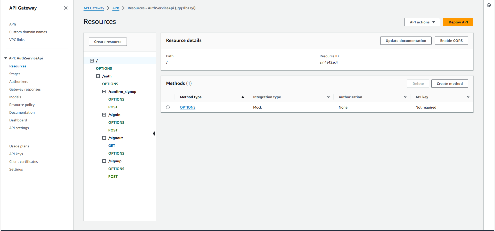

## Serverless REST Assignment.

__Name:__ Sisi Chen

__Video demonstration:__ [Serverless assignment 1](https://www.youtube.com/watch?v=WYxxPOyRjeY)

This repository contains an implementation of a serverless REST API for the AWS platform. The CDK framework is used to provision its infrastructure. The API's domain context is movie reviews.

### API endpoints.

+ POST /movies/reviews - add a movie review.
+ GET /movies/{movieId}/reviews - Get all the reviews for the specified movie.
+ GET /movies/{movieId}/reviews?minRating=n - Get the reviews for the specified movie with a rating greater than the minRating.
+ GET /movies/{movieId}/reviews/{reviewerName} - Get the review written by the named reviewer for the specified movie.
+ PUT /movies/{movieId}/reviews/{reviewerName} - Update the text of a review.
+ GET /movies/{movieId}/reviews?year=n - Get the reviews written in a specific year for a specific movie.
+ GET /reviews/{reviewerName} - Get all the reviews written by a specific reviewer.
+ GET /reviews/{reviewerName}/{movieId}/translation?language=code - Get a translated version of a movie review using the movie ID and reviewer name as the identifier.


### rest API.


### auth API.



### Authentication (if relevant).


### Independent learning (If relevant).

+ Add the translation function by 
`import { TranslateClient, TranslateTextCommand } from "@aws-sdk/client-translate";`
 But this time the translation cannot be use successful
 

I find that it was caused by the root.Searching for the Internet and get the method.
add this Policies in your IAM Roles

```json
{
    "Version": "2012-10-17",
    "Statement": [
        {
            "Effect": "Allow",
            "Action": "translate:TranslateText",
            "Resource": "*"
        }
    ]
}
```

and

```json
{
    "Version": "2012-10-17",
    "Statement": [
        {
            "Sid": "Statement1",
            "Effect": "Allow",
            "Action": "comprehend:DetectDominantLanguage",
            "Resource": "*"
        }
    ]
}
```

+ Add the comparation the content in JSON and the content in path when updating the review
+ Adding URL encoding conversion(from '%20' to ' ')
